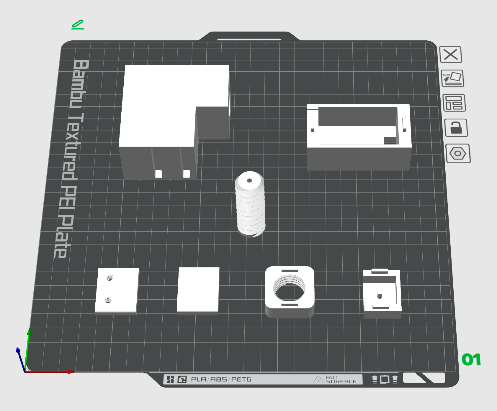
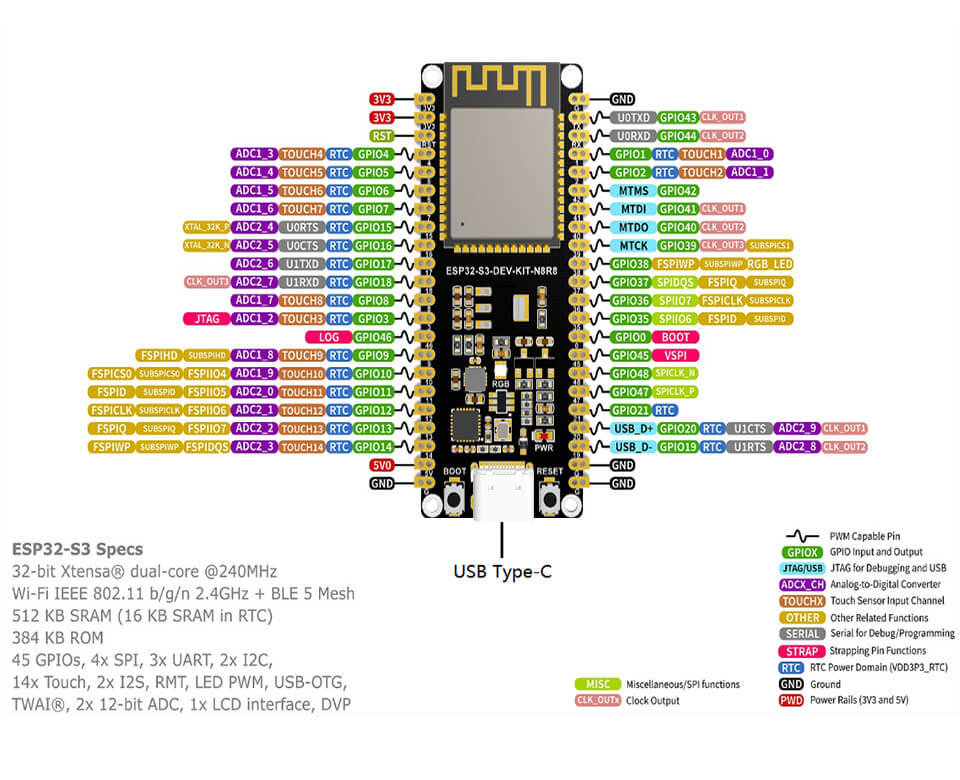

# fish-feeder

鱼缸自动喂食器，支持定时和定量喂食, 使用 Home Assistant 远程控制设备。

## 开发环境

- **3D 建模**：Blender
- **3D 打印机**：拓竹 A1
- **硬件设备**：ESP32S3 开发板，GA12-N20 减速电机
- **开发工具**：Arduino，PlatformIO
- **其他服务**：Home Assistant，MQTT

## 3D 打印

3D 打印源文件、STL模型、3MF切盘文件在 [3d-models](3d-models) 目录中



## 开发板说明

使用微雪 [ESP32-S3-DEV-KIT-N8R8](https://www.waveshare.net/wiki/ESP32-S3-DEV-KIT-N8R8) 开发板，板载 ESP32-S3 芯片，可通过一个 USB-C 接口同时进行 USB 和 UART 使用和开发，非常方便。



## 编译固件

项目基于 Arduino 框架开发，并通过 PlatformIO 进行管理，详细步骤如下：

```bash
# 初始化项目，如何你的开发板和我一样可以跳过这一步
$ pio boards esp32 # 查看支持的开发板
$ pio project init --board esp32-s3-devkitc-1 --project-option "framework=arduino"

# 查看已连接的设备，并修改 platformio.ini 文件中的上传和监视端口
$ pio device list

# 编译固件，上传并监视串口输出
$ pio run -t upload -e esp32s3
$ pio device monitor -e esp32s3
```

## 服务部署

通过 Docker 容器部署 **Home Assistant** 和 **MQTT** 服务，具体步骤参考 [docker-compose.yml](docker-compose.yml) 文件。

```bash
# 启动服务
docker-compose up -d
```

## Home Assistant 配置

1. 安装 `MQTT` 集成组件，配置连接到 MQTT 服务。
2. 进入 Home Assistant 容器，编辑 `configuration.yaml` 文件，添加以下配置：

```yaml
mqtt:
  switch:
    unique_id: fish_feeder_a_switch
    name: "鱼缸喂食器 A 开关"
    command_topic: "fish_feeder_a/switch"
  button:
    unique_id: fish_feeder_a_button
    name: "鱼缸喂食器 A 按钮"
    command_topic: "fish_feeder_a/button"
  number:
    unique_id: fish_feeder_a_feed_hour
    name: "鱼缸喂食器 A 喂食小时"
    command_topic: "fish_feeder_a/feed_hour"
    min: 0
    max: 23
  number:
    unique_id: fish_feeder_a_feed_minute
    name: "鱼缸喂食器 A 喂食分钟"
    command_topic: "fish_feeder_a/feed_minute"
    min: 1
    max: 59
```
3. 重启 Home Assistant 服务，就会看到鱼缸喂食器的实体了
4. 修改创建仪表盘，添加鱼缸喂食器的控制按钮